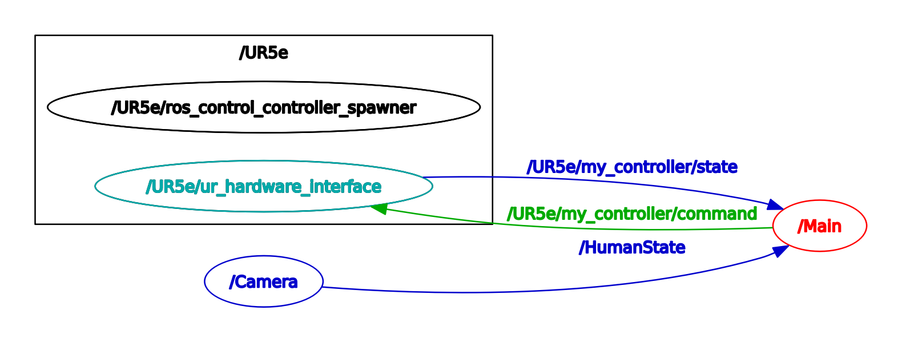

# Safety-Guaranteed-and-Task-Consistent-Human-Robot-Interaction
This repository is for the paper **"Safety-Guaranteed and Task-Consistent Human-Robot Interaction Using High-Order Time-Varying Control Barrier Functions and Quadratic Programs"** submitted to ***IEEE Robotics and Automation Letters*** by **Kaige Shi** and **Guoqiang Hu**.

The above figure shows the node graph of the ROS project. The node **/UR5e/ur_hardware_interface** interacts with a UR5e robot. The node **/Camera** calculates the human states based on frames from a RealSense LiDAR camera. The node **/Main** implements the algorithm of the proposed control framework. It receives human states from the node **/Camera** via the topic **/HumanState** and robot states from the node **/UR5e/ur_hardware_interface** via the topic **/UR5e/my_controller/state**, and sends the joint velocity command to the node **/UR5e/ur_hardware_interface** via the topic **/UR5e/my_controller/command**.
